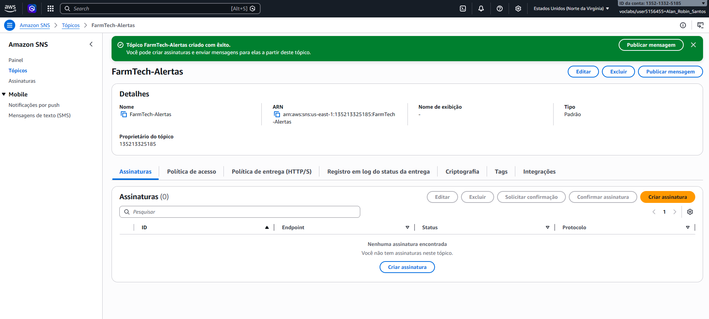
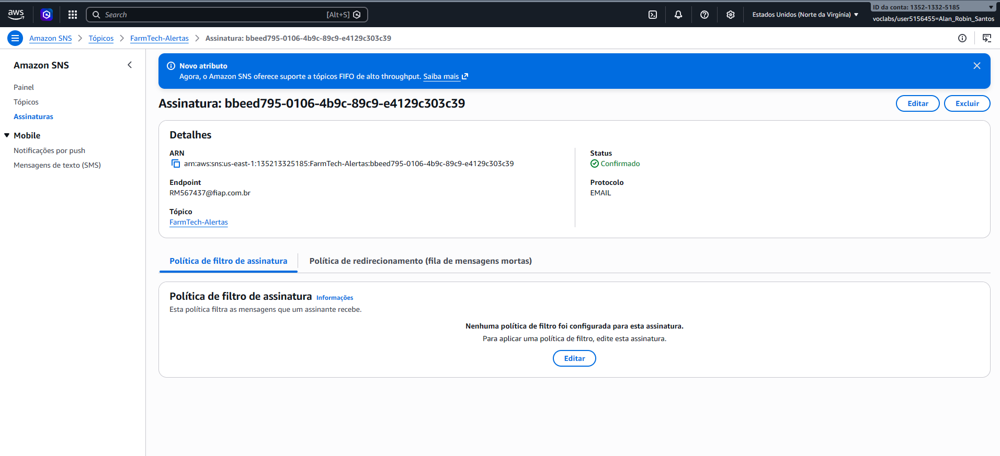

# FIAP - Faculdade de Informática e Administração Paulista


# 🚀 FASE 7 — A Consolidação de um Sistema Integrado
## 📚 Graduação ON em Inteligência Artificial

---

## 🎬 Apresentação do Projeto (Vídeo)
**Link do Vídeo Demonstrativo:** [[LINK DO YOUTUBE NÃO LISTADO](https://youtu.be/S5JuxLw_aOc)]

---

## 👩🏻‍💻 Sobre esta Fase

Esta fase representa uma etapa da minha evolução na Graduação ON em Inteligência Artificial da FIAP.

Aqui estão organizados:

- 📖 Conteúdos teóricos estudados
- 🧠 Conceitos fundamentais consolidados
- 🛠 Tecnologias aplicadas
- 📂 Projetos desenvolvidos
- 📊 Resultados obtidos
- 🎯 Competências adquiridas

Esta documentação tem como objetivo demonstrar, de forma estruturada, o que foi aprendido e aplicado durante esta etapa do curso.

---

## 🎯 Objetivo da Fase

Integrar todos os serviços desenvolvidos nas Fases 1 a 6 e consolidar um ecossistema de gestão inteligente para o agronegócio (FarmTech Solutions). O foco principal foi unificar a predição de Machine Learning, a infraestrutura de Banco de Dados, a leitura de sensores IoT, o reconhecimento de imagens (Visão Computacional) e a mensageria Cloud em um único Dashboard SaaS centralizado e seguro.

---

## 📖 Conteúdos Abordados

- Arquitetura de Software e Integração de Sistemas em Python (Streamlit)
- Algoritmos de Machine Learning (Random Forest Regressor)
- Modelagem de Banco de Dados Relacional (MER/DER)
- Monitoramento IoT com simulação de sensores físicos (ESP32)
- Visão Computacional para detecção de objetos (YOLOv5)
- Cloud Computing e Mensageria Serverless (AWS SNS)
- Padrões de Cybersegurança e Compliance (ISO 27001 / Mocking de APIs)

---

## 🛠 Tecnologias Utilizadas

Durante esta fase, foram utilizadas as seguintes tecnologias:

- **Linguagem & Interface:** Python, Streamlit
- **Dados & Machine Learning:** Pandas, NumPy, Scikit-Learn, Matplotlib, Seaborn
- **Visão Computacional:** PyTorch, OpenCV (cv2), YOLOv5, Pillow
- **Cloud & Segurança:** AWS SNS (Simple Notification Service), Boto3 (Mock)

---

## 📂 Projetos Desenvolvidos

O sistema foi consolidado em uma aplicação de navegação lateral (Dashboard), dividida nos seguintes módulos integrados:

### 📌 Módulo 1 — Inteligência Artificial e IoT (Fases 1, 3 e 4)

**Descrição:**
Um painel preditivo que lê dados históricos (`.csv`) e treina um modelo de Machine Learning (`Random Forest`) para prever a umidade do solo com base em telemetria IoT simulada (Temperatura, Precipitação, pH e Nutrientes). O painel sugere ações automatizadas de irrigação em tempo real.

**Principais aprendizados:**
- Treinamento e extração de métricas de avaliação (R², MAE, MSE).
- Visualização de dados dinâmicos e plotagem de gráficos de tendências com `st.line_chart`.

---

### 📌 Módulo 2 — Visão Computacional da Lavoura (Fase 6)

**Descrição:**
Módulo de análise de imagens focado na detecção de gado e maquinário agrícola utilizando a rede neural YOLOv5. 

**Decisão de Arquitetura (Modo Offline):** Para mitigar riscos de bloqueio por Firewalls corporativos ou acadêmicos (Erro `WinError 10060`), o motor de inferência da YOLOv5 foi embarcado localmente no repositório. O script converte caminhos POSIX em tempo de execução para rodar nativamente em ambientes Windows sem exigir downloads extras do GitHub, desenhando as Bounding Boxes matematicamente via `OpenCV`.

---

### 📌 Módulo 3 — Cloud Computing & Mensageria (Fases 5 e 7)

**Descrição:**
Integração com a AWS para o disparo de alertas emergenciais aos funcionários da fazenda via E-mail utilizando o AWS SNS (Simple Notification Service).

**Arquitetura de Segurança (ISO 27001):**
Atendendo aos rigorosos requisitos de segurança (ISO 27001), o código-fonte exposto neste repositório não contém as credenciais (`Access Keys` / `Secret Keys`) em texto plano (*hardcoded*). A interface Python atua como um simulador seguro (Mock), gerando o payload JSON autêntico. A infraestrutura em nuvem, contudo, foi 100% provisionada e validada em ambiente real, conforme as evidências abaixo:

> **Evidência 1: Tópico Padrão Criado na AWS SNS**
> 

> **Evidência 2: Assinatura de E-mail Confirmada**
> 

---

## 🚀 Como Executar o Projeto Localmente

**1. Instalação de Dependências:**
Abra o terminal na pasta raiz do projeto e instale as bibliotecas necessárias:
```bash
pip install streamlit pandas numpy scikit-learn matplotlib seaborn torch torchvision opencv-python pillow tqdm pyyaml requests
```

**2. Executando a Central de Comando:**
No mesmo terminal, inicie a aplicação interativa:
```bash
python -m streamlit run main.py
```

## 🧠 Competências Desenvolvidas

Ao final desta fase, consolidamos:

✔️ Capacidade de estruturar problemas de IA e integrá-os em uma interface unificada.

✔️ Construção e avaliação de modelos preditivos para agricultura de precisão.

✔️ Implementação de Visão Computacional on-premise à prova de falhas de rede.

✔️ Documentação técnica clara aliada a boas práticas de segurança Cloud (Zero Trust / ISO 27001).

## 👥 Equipe Desenvolvedora

Alan Robin

Lucas Amorim